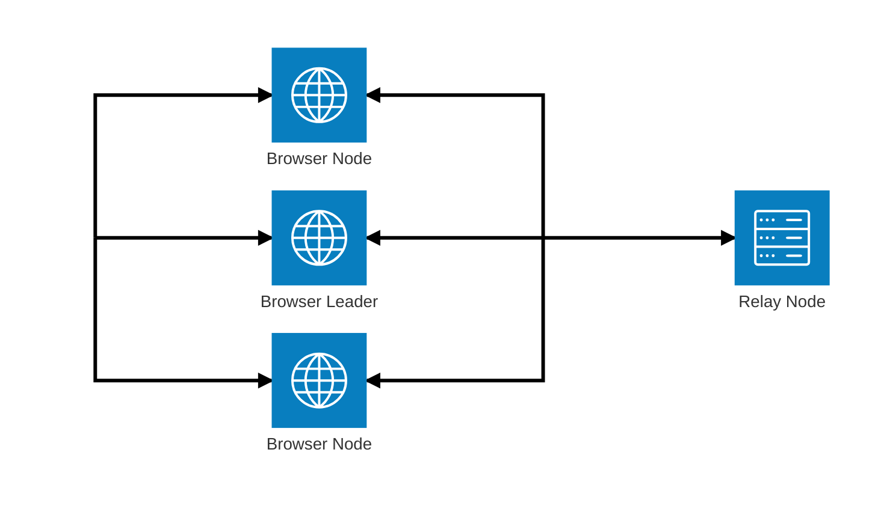

## Stashcrate

Stashcrate is a simple and lightweight app to share content with your friends and family in a decentralized, encrypted way.

## Production

[stashcrate.io](https://stashcrate.io/)

## Architecture diagram

### Diagram

### Connections
- Browser <-> Browser : WebRTC, if direct connection is possible, otherwise traffic goes through Relay Node.
- Browser <-> Relay : Websocket or WebTransport

Connection low level logic is controlled by `libp2p`.

### Repository Folders

- `be` - Backend - Relay Node
- `fe` - Frontend - Web UI + Browser Node
- `libs/icon-crypto-js` - WebAssembly implementation of Shamir Secret Sharing
- `libs/protocols` - Protocols and common utilities that are shared between backend and frontend
- `docs` - Additional documentation

## Local development

```
yarn install --immutable
```

Run backend
```
cd be
yarn dev
```

Take note of the multiaddrs the server is listening on in the backend's standard output. It should look like `/ip4/127.0.0.1/tcp/8080/p2p/Qm...XnBs`.

The part `/ip4/127.0.0.1/tcp/8080` of the multiaddr is the address the backend is listening on, and it can be changed via `config.yaml`, ideally by creating `config.local.yaml`

The last part of the multiaddr (`Qm...XnBs`) is the peer ID. A private key from which peer ID derives from is created - if it does not exist - and stored by default in `data/peer-id-private-key.json` (the path can be changed with `PEER_ID_FILE_PATH` env variable).


Make sure the multiaddrs output by the backend is written into `/fe/.env.local` under the `VITE_BOOTSTRAP_MULTIADDRS` variable.

```
VITE_BOOTSTRAP_MULTIADDRS=/ip4/127.0.0.1/tcp/8080/p2p/Qm...XnBs
```

and then run frontend

```
cd fe
yarn dev
```

## Manually deploy frontend client in Netlify Preview context

```bash
cd fe
yarn workspace @icod2/fe build && netlify deploy --no-build --site c77e7e89-f17e-4593-9579-47bc6b863b8d
```

## Frontend Developer Features

The `icod2Dev` object is exposed on the `window` object in development mode. It persists its state across page reloads. It provides the following features:

### `loggerLevel`

Allows you to set the log level for the frontend. On production it is by default set to `error` to minimize log output.

*   `set(level: string)`: Sets the log level.
*   `get()`: Gets the current log level.

Example usage in the console:

```javascript
window.icod2Dev.loggerLevel.set('log'); //accepts 'log', 'warn', 'error', 'none' & undefined
```

### `lockedBoxAutoLoad`

Allows you to automatically load a specific box when the app starts.

*   `set(box: string)`: Sets the box ID to automatically load.
*   `get()`: Gets the box ID that will be automatically loaded.

Example usage in the console:

```javascript
window.icod2Dev.lockedBoxAutoLoad.set({/* json object from download locked box file */});
```

### `countDownOverride`

Allows you to override the countdown timer for a specific box.

*   `set(box: string)`: Sets the box ID to override the countdown for.
*   `get()`: Gets the box ID that has its countdown overridden.

Example usage in the console:

```javascript
window.icod2Dev.countDownOverride.set(10000 /* 10 seconds */);
```

### `topNavTools`

Allows you to enable developer tools in the top navigation bar.

*   `set(box: string)`: Enables the tools.
*   `get()`: Gets the status of the tools.

### `bootstrapMultiaddr`

Normally the mutliaddr is set via an env varable and is backed into js bundle. If for some reason one wants to change it: `window.icod2Dev.bootstrapMultiaddr.set()` is available.

`.get()` and `.set()` allows to manage the bootstrap multiaddrs from within browser's console log.
